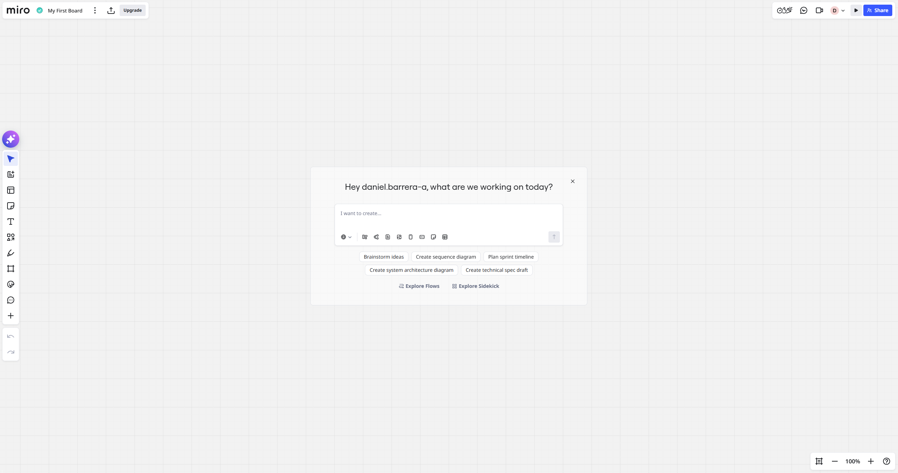
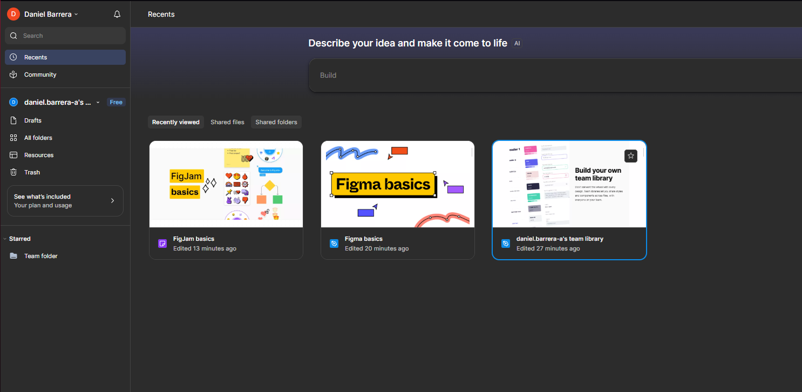
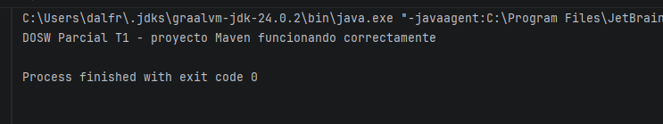

# DOSW_Parcial_T1_DanielBarrera

## Datos del estudiante

- **Nombre completo:** _(completa aquí)_
- **Grupo DOSW:** _(completa aquí)_
- **Enunciado asignado (Parte 3):** _(se completa el día del parcial)_

## Estructura del proyecto

```
DOSW-ParcialT1
├── pom.xml
├── src
│   ├── main/java/edu/dosw/parcial/App.java
│   └── test/java/edu/dosw/parcial/AppTest.java
├── docs/
│   ├── uml/            # Diagramas UML exportados en PDF o PNG
│   ├── images/          # Capturas de ejecución
│   └── requirements/    # Requisitos funcionales y no funcionales
```

## Evidencias — prerrequisitos

### Acceso a herramienta de modelado (Miro)


### Acceso a Figma


### El proyecto corre correctamente con Maven

